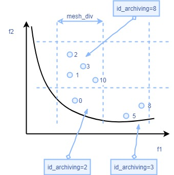

https://blog.csdn.net/m0_38097087/article/details/79818348?utm_source=blogxgwz1&utm_medium=distribute.pc_relevant.none-task-blog-title-2&spm=1001.2101.3001.4242
# 多目标粒子群算法

[TOC]

## 关于archiving.py模块中MeshCrowd.get_crowd()方法的解释

#### 这是利用网格法计算粒子的拥挤度，看论文有详解

* 1.本图结合程序，网格法中网格间距定义为mesh_div/(mesh_max[i] - mesh_min[i])),具体可参考cal_mesh_id()方法，计算出每个网格的编号。
* 2.假定粒子编号为index=0的粒子在id_archiving=2的网格/网孔中；编号为index=5、8的粒子都在id_archiving=3的网格中；编号为index=1/2/3/10的粒子在id_archiving=8的网格中。
* 3.以网格8为例，第一个for循环到的same_num=4,是在同一个网格中粒子的数量；
* 4.那么网格8中所有粒子的拥挤度为sam_num=4,是第二个循环要做的事情。网格2中index=0的粒子的拥挤度为1，index=5/8的粒子拥挤度都是2，这样就可以得到每个粒子的拥挤度。

